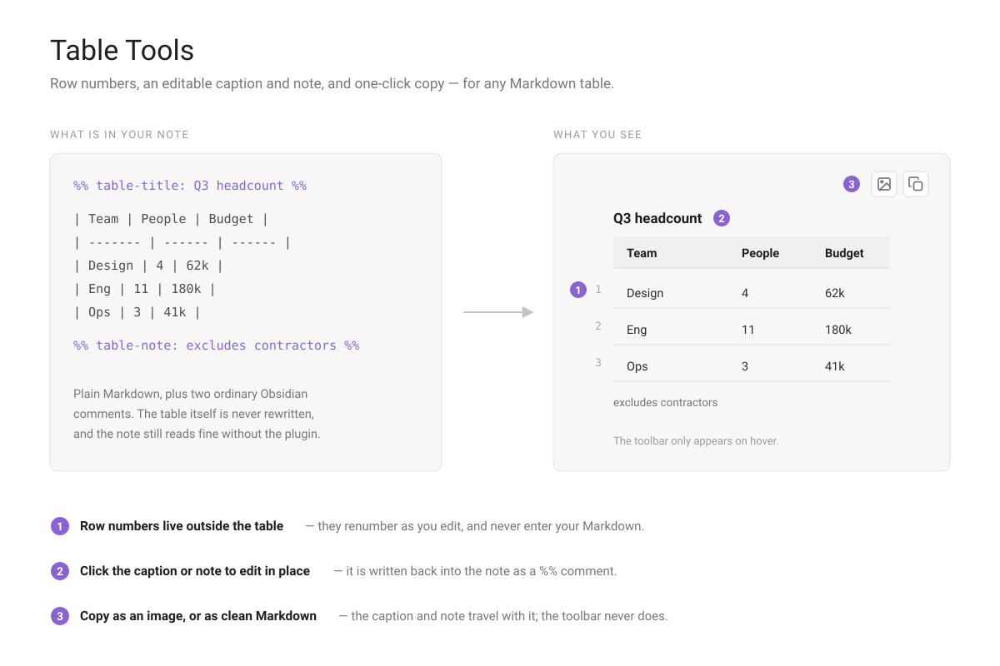

# Table Tools

Markdown tables in Obsidian have no row numbers, nowhere to put a caption, and no
way to hand one to somebody else without reformatting it by hand. Table Tools adds
all three, without touching the table's Markdown.



## What it does

**Row numbers in the gutter.** Every body row is numbered in the margin beside the
table. The numbers are drawn outside it, so they renumber themselves as you add and
delete rows and never end up in your Markdown.

**A caption above and a note below.** Click either one to type; press `Enter` to save
or `Escape` to discard. Both are stored in the note itself, as ordinary Obsidian
comments:

```markdown
%% table-title: Q3 headcount %%

| Team    | People | Budget |
| ------- | ------ | ------ |
| Design  | 4      | 62k    |

%% table-note: excludes contractors %%
```

The comment lines are hidden in Reading view and in Live Preview, and reappear in
source mode or when your cursor is on them. Because they are plain comments, the
note stays readable — and the table stays valid Markdown — with the plugin
disabled or uninstalled.

**Copy the table out.** Hovering a table reveals two buttons in its top-right corner:

- **Copy as image** renders the table, caption and note to a PNG on your clipboard,
  using your current theme. The toolbar and any empty placeholders are left out of
  the shot. If the clipboard is unavailable the PNG is saved into your vault instead.
- **Copy as Markdown** puts a clean Markdown table on the clipboard, with the caption
  as a bold line above it and the note in italics below.

There is also a **Process tables on this page** command, for the rare table that a
plugin or an embed renders after the page has settled.

## Installing

From Obsidian: **Settings → Community plugins → Browse**, search for *Table Tools*,
then Install and Enable.

Manually: download `main.js`, `manifest.json` and `styles.css` from the
[latest release](https://github.com/RainaJIA716/obsidian-table-tools/releases/latest)
into `<your vault>/.obsidian/plugins/table-tools/`, then enable the plugin in
Settings.

## Notes

- The interface follows Obsidian's own language setting: Chinese when Obsidian is in
  Chinese, English otherwise.
- Editing a caption or note rewrites that one comment line in the note. The table's
  own rows are never rewritten.
- If a table cannot be matched back to a line in the note — which can happen inside
  an embed or a rendered code block — the caption and note are read-only there, and
  a notice says so rather than writing to the wrong place.

## Building it yourself

```bash
npm install
npm run build     # bundles src/ into main.js
```

Releases are built by GitHub Actions from a version tag and published with build
provenance, so the `main.js` in a release can be verified against this source.

## License

[MIT](LICENSE)
